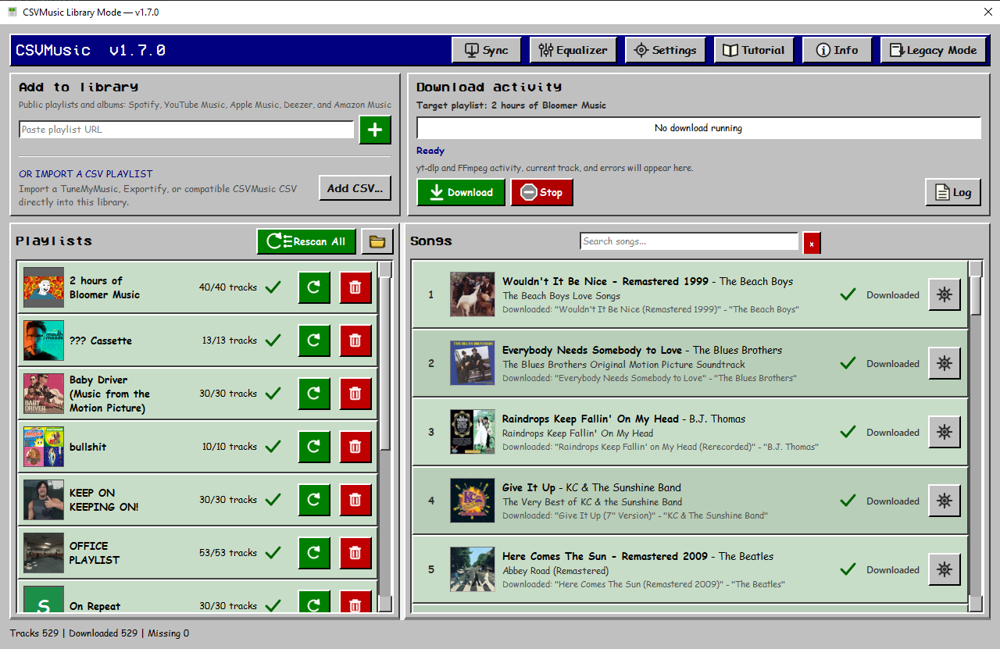

# CSVMusic

<table align="center">
  <tr>
	<td colspan="2"></td>
  </tr>
</table>

<h2 align="center"><a href="https://buymeacoffee.com/agalli">☕ Enjoying CSVMusic? Buy me a coffee</a></h2>

**Convert playlists and albums from music links or CSV exports into fully tagged audio files.**

CSVMusic accepts playlist and album links from supported music services, or a playlist exported as CSV from TuneMyMusic, and automatically:
- Finds the best match on YouTube Music
- Downloads the audio
- Adds metadata such as artist, album, and artwork
- Outputs ready-to-use **M4A** or **MP3** files, with optional native **Opus** output
- Optionally creates `.m3u` / `.m3u8` playlists

---

# Download

Go here:
https://github.com/angall1/CSVMusic/releases/tag/v1.7.3

Download one of the following based on your OS:

### Windows
https://github.com/angall1/CSVMusic/releases/download/v1.7.3/CSVMusic-windows.zip

### macOS (Apple Silicon)
https://github.com/angall1/CSVMusic/releases/download/v1.7.3/CSVMusic-macos-arm64.zip

### macOS (Intel)
https://github.com/angall1/CSVMusic/releases/download/v1.7.3/CSVMusic-macos-intel.zip

### Linux
https://github.com/angall1/CSVMusic/releases/download/v1.7.3/CSVMusic-linux.zip

Extract the ZIP before running the app. If your desktop does not launch the files directly, open a terminal in the extracted folder and run:

```bash
chmod +x CSVMusic yt-dlp
./CSVMusic
```

If Linux reports that the Qt `xcb` platform plugin could not be initialized, install the commonly required cursor runtime and retry:

```bash
sudo apt update
sudo apt install libxcb-cursor0
```

Additional Linux diagnostics are included in `README-LINUX.md` inside the release archive.

If launch fails, copy the terminal output along with `uname -m` and the contents of `/etc/os-release` when reporting the problem.

---

# Python Wheel / Source Install

Install the wheel with `python -m pip install CSVMusic-*.whl`, or install a source checkout with `python -m pip install -e .`.
Then launch CSVMusic with either:

```text
csvmusic
python -m csvmusic
```

Python installations still require a supported graphical desktop environment for the Qt interface. Android, Andronix, and other phone-hosted Linux environments are not currently supported or tested.

---

# What's New In 1.7.3

## Amazon Music, Linux, and startup reliability

- Added support for current Amazon Music shared playlist links (`/user-playlists/...`) across regional Amazon Music domains, including metadata, artwork, duration, and playlist order.
- Added software-rendering safeguards for Qt WebEngine on Linux to prevent Spotify playlist scans from closing the app on affected Mint and Fedora systems.
- Fixed Library Mode startup with playlists containing saved download errors ([#72](https://github.com/angall1/CSVMusic/issues/72)).
- Added update notifications directly to the default Library Mode, with download, remind-later, and skip-version choices.
- Suppressed Qt's harmless malformed-image ICC warning while retaining other Qt warnings and errors.

---

# What's New In 1.7.2

## Album artwork reliability

- Fixed Library Mode downloads omitting embedded artwork when the original service artwork URL was unavailable ([#71](https://github.com/angall1/CSVMusic/issues/71)).
- CSVMusic now prefers the source album cover and reliably falls back to the matched YouTube thumbnail.
- Confirmed current Linux packaging includes the Qt/XCB cursor dependency associated with [#66](https://github.com/angall1/CSVMusic/issues/66).
- Confirmed Apple Silicon releases fetch, architecture-check, and execute an ARM64 FFmpeg binary during every build, addressing [#68](https://github.com/angall1/CSVMusic/issues/68).

---

# What's New In 1.7.1

## Cross-platform presentation and playlist files

- Bundled Comic Neue and applied an explicit high-contrast Qt palette so fonts, controls, selections, and disabled states render consistently on Windows, macOS, and Linux desktop themes.
- Added a remembered custom output folder for M3U and M3U8 playlist files in Library and Legacy modes, while retaining the existing alongside-audio default.
- Playlist entries now use paths relative to the M3U file, supporting players that require separate music and playlist folders; cross-drive Windows layouts safely use absolute paths.
- Refined the Sync and Legacy Mode header icons for clearer rendering at toolbar sizes.

---

# What's New In 1.7.0

## Library-first workflow

- Made Library Mode the default interface while retaining Legacy Mode from the header.
- Added persistent multi-playlist management, live scan progress, playlist and song search, per-song metadata editing, alternative-source selection, and low-confidence review.
- Added direct public playlist and album imports for Spotify, YouTube Music, YouTube, Apple Music, Deezer, and Amazon Music, alongside standalone TuneMyMusic/Exportify-compatible CSV imports.
- Improved large-playlist scanning, incomplete-scan reporting, duplicate/repeated-track handling, removed-track reconciliation, and download-time UI responsiveness.

## Download matching and output

- Prefer YouTube Music candidates and expose each alternative's source and album metadata.
- Penalize unintended live, acoustic, remix, edit, and mismatched versions while preserving explicitly requested versions.
- Queue alternative selections for batch download, remove superseded local versions after successful replacement, and rebuild complete M3U playlists.
- Added per-song volume adjustment, themed equalizer/settings interfaces, a searchable song list, live download states, and a detailed process/error log.

## Portable-player sync

- Added selective portable-player synchronization, Select All, progress reporting, device playlist inspection/deletion, optional automatic eject, and safer Windows eject handling.
- Added experimental classic iPod database synchronization on Windows, Linux, and macOS with playlist replacement, selected-alternative identity tracking, verified writes, backups, and alphabetical playlist ordering.
- Release ZIPs include a native libgpod helper for Linux and each macOS architecture. Windows includes the Linux helper and requires Windows Subsystem for Linux to be enabled.
- Added folder/M3U8 synchronization for compatible USB mass-storage music players.

## Safety and presentation

- Added the first-run safety/support notice, large-playlist and YouTube-throttling guidance, updated tutorial/info pages, and direct support links.
- Refined the retro skeuomorphic interface, card states, icons, scrollbars, spacing, long-title handling, and startup behavior.

---

# What's New In 1.6.6 (Since 1.6.0)

## Updates and MP3 reliability

- Added a lightweight startup update check that prompts when a newer stable CSVMusic release is available, with options to download, be reminded later, or skip that version.
- Fixed intermittent MP3 failures when YouTube exposes only a combined audio/video stream. CSVMusic still prefers audio-only downloads and now safely falls back to extracting audio from the best available combined stream.

## YouTube reliability

- Fixed preflight incorrectly reporting the bundled yt-dlp as too old when antivirus scanning or slower storage made its version probe take more than three seconds.
- Added yt-dlp's automatic YouTube client selection as an early fallback, allowing current upstream clients such as `visionos` to recover when a forced client temporarily exposes no playable formats.
- Updated and pinned yt-dlp to `2026.08.19`, fixing widespread HTTP 403 failures with current YouTube `web_embedded` downloads and preventing release builds from silently changing downloader versions.
- Fixed current YouTube player-challenge failures by packaging Deno and `yt-dlp-ejs`, passing the runtime explicitly, and validating both before downloads begin.
- Updated YouTube client fallbacks and diagnostics for current yt-dlp behavior, including clearer HTTP 403, throttling, and JavaScript-runtime messages.
- Added adaptive pacing when YouTube starts throttling or blocking a playlist download.
- Improved force-download handling for low-confidence matches and added candidate fallbacks.

## Playlist imports and workflow

- Added first-class **Exportify CSV** support for `Track URI`, `Album Name`, `Artist Name(s)`, release dates, and CSVs without a playlist column.
- Renamed **Load Playlist** to **Resume Playlist** and replaced its folder/file fork with one chooser that accepts a folder or `.m3u`/`.m3u8` file.
- Added a compact **Paste URL…** action to Alternatives for downloading a specific YouTube or YouTube Music video.
- Improved playlist accounting so existing files, queued tracks, duplicate entries, skipped matches, and failures reconcile with the requested track total.

## Audio and Windows packaging

- Shortened exceptionally long track filenames with a stable uniqueness suffix, preventing Windows output-path failures from being misreported as YouTube throttling.
- Added optional native **Opus** output under Settings. Opus streams are remuxed without lossy re-encoding and support metadata and artwork.
- Prevented FFmpeg failures caused by selecting Apple Music or iTunes auto-import folders.
- Fixed Windows release builds by accepting Deno's PowerShell-formatted SHA256 metadata while retaining archive integrity verification on every platform.
- Forced UTF-8 for packaged downloader and FFmpeg subprocesses so Unicode song titles and sanitized punctuation work reliably on Windows.

---

# How It Works

1. Open the app. Library Mode is the default interface.
2. Paste a supported public playlist or album link, or click **Add CSV...** for a compatible CSV export.
3. Scan the added playlist, review any warnings or low-confidence matches, and select it.
4. Click **Download**, confirm the output settings, then click **Start Download**.

## Library Mode

Library Mode keeps multiple public Spotify, Apple Music, YouTube Music, and YouTube playlists in one persistent local catalog:

1. Paste a public playlist or album URL into **Add to library**, then click the green add button. Repeat for additional playlists; duplicate links are ignored.
2. Use **Rescan All** or the refresh button beside one playlist. Spotify uses the public-page scanner; other supported sources load public metadata directly.
3. Select a playlist and review its song states. Yellow entries need review; red entries still need downloading.
4. Click **Download**, configure the shared output folder and format, then click **Start Download**.
5. Use **Sync** if you want to copy selected completed playlists to a supported portable player.

The library is saved locally as `library.json` in CSVMusic's settings folder by default. **Save As...** can create a portable library file. Rescanning preserves track selections and manual YouTube corrections while reporting added and removed tracks.

For standalone development testing, launch only the Library Mode window with:

Windows PowerShell:

```powershell
.\.venv\Scripts\python.exe -m csvmusic.library_mode_ui
```

macOS or Linux:

```bash
./.venv/bin/python -m csvmusic.library_mode_ui
```

To fix a wrong download, select the track, click **Set YouTube Match...**, and paste the correct YouTube or YouTube Music video URL. That track is queued for replacement, and the replacement flag clears after a successful download. **Toggle Redownload** can also replace a track while retaining automatic matching.

CSV import is a standalone import method and can be used at any time. It is also useful when a service link is private, unsupported, incomplete, or cannot expose every track:

1. Click **Choose...** next to **Source**.
2. Select **CSV File**.
3. Use the TuneMyMusic link in that window if you need to create a CSV:
   - Choose the original music service as the source.
   - Paste the same playlist link, or connect the service if TuneMyMusic asks.
   - Export to file as a **CSV file**.
4. Load the CSV, choose an output folder, and click **Start**.

If a song cannot be matched confidently:
- It will show up highlighted in yellow.
- Click **Alternatives** to pick a better result.
- Use **Listen** to preview a candidate in your browser.

---

# What You Get

- Audio files with:
  - Correct artist/title
  - Album info
  - Embedded artwork
- Optional playlist files:
  - `.m3u`
  - `.m3u8`

Everything is ready to drop into iTunes, a phone, an MP3 player, or a local music library.

---

# Important Notes

- Keep all files in the extracted folder together.
- The packaged app includes:
  - `ffmpeg`
  - `yt-dlp`
  - `yt-dlp-ejs`
  - Deno
- Some antivirus software may flag bundled download/processing tools. These are usually false positives.
- Your CSV stays local. Direct links are fetched only to read public playlist or album metadata.
- YouTube Music / YouTube is contacted to search and download audio.
- Cookies are optional, but may help with age-restricted or sign-in-only videos.
- Current YouTube extraction requires a supported JavaScript runtime. Packaged releases include Deno and the needed `yt-dlp` extras; source installs should use `pip install -e .` and provide Deno 2.3+ or Node 22+.
- Private playlists or pages that hide track data may not import directly. If that happens, export a CSV from TuneMyMusic and load that instead.
- Spotify's public website can change without notice. Library Mode uses an experimental browser-based scanner for public playlists; review any incomplete-scan warning before downloading. TuneMyMusic CSV import remains available as an independent import method.

---

# Supported Sources

Direct link import supports public playlist or album pages from:
- Spotify
- Apple Music
- YouTube Music
- YouTube playlists
- SoundCloud sets
- Deezer
- Amazon Music, when the page exposes public track data

CSV import supports any service TuneMyMusic can export, including most other music platforms.

### Spotify Web API metadata test

An experimental metadata-only importer is available for testing Spotify Web API access. It retrieves playlist and track metadata and prints the normalized result as JSON. It does not save the access token.

For the guided graphical test, run:

```powershell
.\.venv\Scripts\python.exe -m csvmusic.spotify_api_test_ui
```

The graphical test is a four-page wizard:

1. Configure the Spotify Developer Dashboard, copy the callback URL, and check the callback port.
2. Enter the public Client ID, sign in with Spotify, and verify API access.
3. Search and sort your playlists, then select any number with checkboxes or **Check All**. Nothing is selected by default.
4. Load the selected playlists and click each playlist to expand its returned tracks.

Authentication uses Authorization Code with PKCE and never requires the Client Secret. The command-line procedure below remains available for troubleshooting.

Spotify currently exposes playlist items through Web API only when the signed-in user owns or collaborates on that playlist. Followed public playlists still appear in the user's playlist list, so the wizard automatically falls back to Spotify's public page metadata when Web API returns this access restriction. Fallback playlists are labeled in the results and may be partial when Spotify's public page does not expose every track.

An additional unsigned-browser experiment can render and scroll a public playlist without Spotify credentials:

```powershell
.\.venv\Scripts\python.exe -m csvmusic.spotify_public_scrape_ui
```

It uses a temporary, non-persistent browser profile and captures only track rows Spotify renders publicly. Spotify may display a sign-in wall or stop exposing additional rows, so this does not guarantee a complete playlist.

#### One-time Spotify setup

1. Sign in to the [Spotify Developer Dashboard](https://developer.spotify.com/dashboard). Spotify currently requires a Premium account for Development Mode apps.
2. Select **Create app**. A suggested name is `CSVMusic Local Test`.
3. Enter `CSVMusic playlist metadata test` as the description.
4. Add `http://127.0.0.1:3000/callback` as the redirect URI. The current command-line test does not receive this callback, but registering it prepares the app for the planned desktop PKCE login.
5. In **Which API/SDKs are you planning to use?**, check **Web API** only. Leave **Web Playback SDK**, **Ads API**, **Android**, and **iOS** unchecked. CSVMusic only needs Web API access to request playlist and track metadata; it does not use Spotify playback, advertising, or mobile SDKs.
6. Accept Spotify's terms and create the app. Spotify's official [app setup documentation](https://developer.spotify.com/documentation/web-api/concepts/apps) explains each field.
7. Keep the app's **Client Secret** private. Do not add it to this repository, settings, or a packaged EXE. The eventual desktop integration will use [Authorization Code with PKCE](https://developer.spotify.com/documentation/web-api/tutorials/code-pkce-flow), which requires only the public Client ID in the application.

#### Get a temporary token for this test

1. Open Spotify's [Get Playlist Items reference](https://developer.spotify.com/documentation/web-api/reference/get-playlists-items).
2. Sign in and use its **Try it** authorization control to create a user access token. If testing a private playlist, authorize `playlist-read-private`.
3. Copy only the generated access-token value. Do not paste the 32-character **Client ID** from the app settings: it identifies your app but cannot authorize an API request. Never paste the **Client Secret**. Spotify access tokens normally expire after one hour; see Spotify's [access-token documentation](https://developer.spotify.com/documentation/web-api/concepts/access-token).
4. In PowerShell, from the CSVMusic repository, set the token for the current terminal and run the importer:

```powershell
$env:SPOTIFY_ACCESS_TOKEN = "your-access-token"
.\.venv\Scripts\python.exe -m csvmusic.fetch_spotify_api "https://open.spotify.com/playlist/PLAYLIST_ID"
```

Replace `PLAYLIST_ID` with the playlist link or paste the complete Spotify playlist URL between the quotes. Under Spotify's current Development Mode rules, the signed-in user must own or collaborate on the playlist. A `401` means the token is missing or expired; a `403` generally means the user or app cannot access that playlist.

Remove the token from the terminal when finished:

```powershell
Remove-Item Env:SPOTIFY_ACCESS_TOKEN
```
